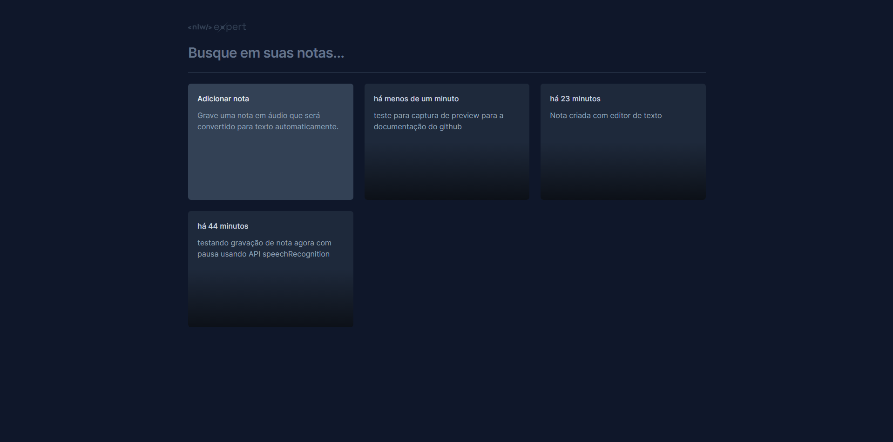
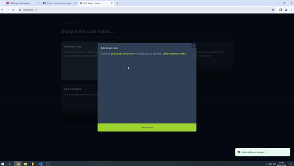
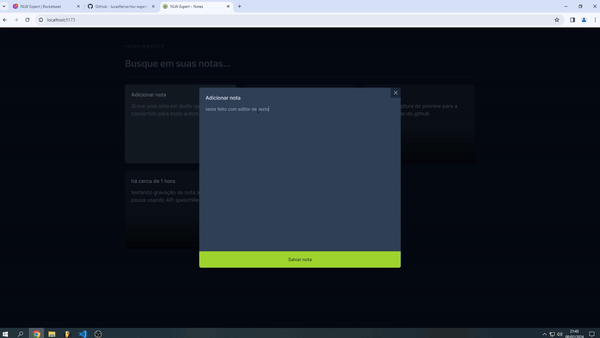
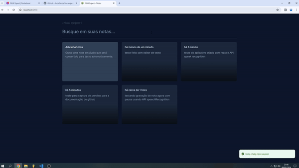

<h1 align="center"> Projeto NLW Expert Notes | Rocketseat </h1>

Evento exclusivo e gratuito, promovido pela Rocketseat para ensino de tecnologias WEB.

  <a href="#-tecnologias">Tecnologias</a>&nbsp;&nbsp;&nbsp;|&nbsp;&nbsp;&nbsp;
  <a href="#-projeto">Projeto</a>&nbsp;&nbsp;&nbsp;|&nbsp;&nbsp;&nbsp;
  <a href="#-layout">Layout</a>&nbsp;&nbsp;&nbsp;|&nbsp;&nbsp;&nbsp;
  <a href="#memo-licença">Licença</a>

  

# Tecnologias

Esse projeto foi desenvolvido com as seguintes tecnologias:

- React
- TypeScript
- Tailwind CSS
- SpeechRecognition API
- Sonner
- Date fns
- Radix UI

# Projeto

Este projeto baseia-se num gerenciador de notas, no qual as notas pode ser criadas por texto ou por gravação de voz, onde o áudio gravado é convertido para texto por meio da transcrição, utilizando a API <b>SpeechRecognition</b>. 

O gerenciador de estilos escolhido foi o <b>Tailwind CSS</b>, por sua praticidade para a composição do layout e responsividade. Junto ao <b>Tailwind CSS</b> , foi utilizado o <b>Radix Ui</b> para criação de Modais e o Sonner para a criação de Toasts (Cards de verificação caso a nota tenha sido salva com sucesso).

O projeto também um filtro para a busca de notas, além da criação e exclusão das mesmas, sendo também ordenadas pelo tempo de criação, tempo este formatado pela biblioteca <b>Date fns</b>.

#  Layout

Você pode visualizar o layout do projeto através [DESSE LINK](https://www.figma.com/community/file/1336456128647909148/nlw-expert-notes). É necessário ter conta no [Figma](https://figma.com) para acessá-lo.

# Licença

Esse projeto está sob a licença MIT.

---

Feito com ♥ by Rocketseat :wave: [Participe da nossa comunidade!](https://discord.gg/rocketseat)
